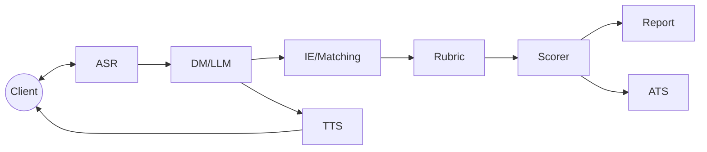

# AI Interview Assistant

AI Interview Assistant проводит техническое собеседование и автоматически оценивает ответы кандидата. Сервис принимает аудиопоток, расшифровывает речь в реальном времени, управляет диалогом через LLM, извлекает навыки и опыт, сопоставляет их с вакансией, оценивает по рубрике и возвращает итоговый отчёт и решение.

## Архитектура



## Quickstart

### MOCK режим
1. Установите зависимости и запустите сервис (LLM и ATS будут замоканы):
   ```bash
   pip install -r requirements.txt
   uvicorn main:app --host 0.0.0.0 --port 8080
   ```
2. Прогоните e2e smoke:
   ```bash
   python scripts/smoke_e2e.py
   ```
   Скрипт сам добавит `?mock=1` и `X-Mock: 1` для `/dm/next` и `/rubric/score`. `ATS_MODE` по умолчанию `mock`, поэтому `/ats/sync` вернёт `202 {"status":"mock-accepted"}`.
3. Ожидаемый вывод:
   ```
   overall: <float>
   decision: <move|discuss|reject>
   report length: <int>
   ```

### REAL режим
1. Запустите vLLM с Qwen‑2.5‑14B‑Instruct на порту 8000:
   ```bash
   python -m vllm.entrypoints.openai.api_server \
       --model Qwen/Qwen2.5-14B-Instruct --host 0.0.0.0 --port 8000
   ```
2. Установите переменные окружения и запустите сервис:
   ```bash
   ATS_MODE=real MOCK_ATS_URL=http://ats.example uvicorn main:app --host 0.0.0.0 --port 8080
   ```
3. Выполните `python scripts/smoke_e2e.py` без флагов — mock не будет использован, если `VLLM_BASE_URL` доступен.

## Пример `/interview/start`
```bash
curl -s -X POST http://localhost:8080/interview/start
# {"session_id":"...","ws_url":"ws://localhost:8080/stream/..."}
```
`ws_url` формируется из `WS_BASE_URL` или из заголовков `X-Forwarded-Proto/Host` при работе за прокси.

## Документация
- [docs/ARCHITECTURE.md](docs/ARCHITECTURE.md)
- [docs/API.md](docs/API.md)
- [docs/SCHEMAS.md](docs/SCHEMAS.md)
- [docs/SETUP_LOCAL.md](docs/SETUP_LOCAL.md)
- [docs/SETUP_DOCKER.md](docs/SETUP_DOCKER.md)
- [docs/ENV_VARS.md](docs/ENV_VARS.md)

## Troubleshooting (кратко)
- Нет vLLM → включите mock (`?mock=1`, `X-Mock: 1`) или запустите vLLM.
- Нет `MOCK_ATS_URL` при `ATS_MODE=real` → `/ats/sync` вернёт 502.
- Некорректный `ws_url` → проверьте `WS_BASE_URL` и `APP_PORT`.
- Нет весов TTS/FAISS → используйте `scripts/bootstrap_models.py` или будет синус‑фолбэк.

## Known Issues (кратко)
- Весов моделей (vLLM, XTTS, FAISS) нет в репозитории — загрузите отдельно.
- PDF отчёт и Riva ASR требуют дополнительных зависимостей.
- SLO собраны на тестовых данных; под нагрузкой значения могут отличаться.
