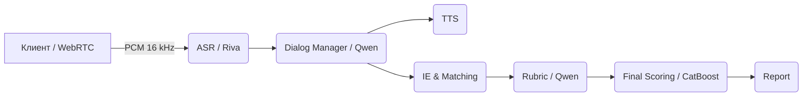

# AI Interview Assistant

AI Interview Assistant проводит техническое собеседование и автоматически
оценяет ответы кандидата. Сервис принимает аудиопоток, расшифровывает речь,
управляет диалогом через LLM, извлекает навыки и проекты, сопоставляет их с
вакансией, выставляет оценки по рубрике и возвращает итоговый отчёт.

## Архитектура на пальцах



## Быстрый старт

1. Подготовьте файл окружения:
   ```bash
   cp .env.example .env  # отредактируйте при необходимости
   ```
2. Запустите локальный vLLM с моделью Qwen‑2.5‑14B‑Instruct:
   ```bash
   python -m vllm.entrypoints.openai.api_server \
       --model Qwen/Qwen2.5-14B-Instruct --host 0.0.0.0 --port 8000
   ```
3. Старт сервиса:
   ```bash
   make run           # или docker compose up -d
   ```

## Smoke‑тест

После запуска сервиса выполните:

```bash
python scripts/smoke_e2e.py
```

Скрипт последовательно вызывает `/ie/extract → /match/coverage → /rubric/score →
/score/final → /report` и выводит:

```
overall: 0.73
decision: move
report length: 12345
```

## Ссылки на документацию

- [docs/ARCHITECTURE.md](docs/ARCHITECTURE.md)
- [docs/API.md](docs/API.md)
- [docs/SCHEMAS.md](docs/SCHEMAS.md)
- [docs/SETUP_LOCAL.md](docs/SETUP_LOCAL.md)
- [docs/SETUP_DOCKER.md](docs/SETUP_DOCKER.md)
- [docs/ENV_VARS.md](docs/ENV_VARS.md)
- Остальные документы см. в каталоге `docs/`.

## Troubleshooting

- Проверьте, что запущен vLLM и доступен `VLLM_BASE_URL`.
- Отсутствие зависимостей приводит к ошибкам при запуске тестов — установите
  пакеты из `requirements.txt`.
- Для работы TTS необходимы веса XTTS‑v2 или Silero; при их отсутствии будет
  сгенерирован синусоидальный звук.

## Known Issues

- В репозитории отсутствуют реальные веса моделей (vLLM, XTTS‑v2, FAISS
  индексы). Их нужно загрузить отдельно.
- Поддержка Riva ASR и генерации PDF отчёта требует дополнительных
  зависимостей.

