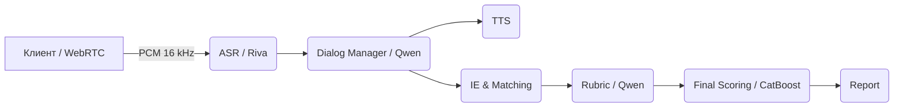

# AI Interview Assistant

AI Interview Assistant проводит техническое собеседование и автоматически
оценяет ответы кандидата. Сервис принимает аудиопоток, расшифровывает речь,
управляет диалогом через LLM, извлекает навыки и проекты, сопоставляет их с
вакансией, выставляет оценки по рубрике и возвращает итоговый отчёт.

## Архитектура на пальцах



## Быстрый старт

### 1) MOCK‑режим (без vLLM/ATS)

1. Подготовьте окружение и запустите сервис (ATS и LLM будут замоканы):
   ```bash
   cp .env.example .env
   uvicorn main:app --host 0.0.0.0 --port 8080
   ```
2. Прогоните smoke‑тест:
   ```bash
   python scripts/smoke_e2e.py
   ```
   Скрипт автоматически добавит `?mock=1` и `X-Mock: 1` для `/dm/next` и `/rubric/score`.
   `/ats/sync` вернёт `202 {"status":"mock-accepted"}` без внешних вызовов.

### 2) REAL‑режим (с vLLM и ATS)

1. Запустите vLLM с моделью Qwen‑2.5‑14B‑Instruct:
   ```bash
   python -m vllm.entrypoints.openai.api_server \
       --model Qwen/Qwen2.5-14B-Instruct --host 0.0.0.0 --port 8000
   ```
2. Установите переменные окружения `ATS_MODE=real` и `MOCK_ATS_URL=<endpoint>`.
3. Запустите сервис (`make run` или `docker compose up -d`).
4. Выполните `python scripts/smoke_e2e.py` — тест пойдёт в REAL‑режиме.

Пример запроса к `/interview/start`:

```bash
curl -s -X POST http://localhost:8080/interview/start
# {"session_id": "...", "ws_url": "ws://localhost:8080/stream/..."}
```

Пример запроса к `/dm/next` в MOCK‑режиме:

```bash
curl -s -X POST 'http://localhost:8080/dm/next?mock=1' \
  -H 'X-Mock: 1' \
  -d '{"jd":{"role":"dev","lang":"en","competencies":[{"name":"ops","weight":1.0,"indicators":[{"name":"monitoring"}]}],"knockouts":[]},"context":{"turns":[{"role":"user","text":"hi"}]},"coverage":{"per_indicator":{"monitoring":0.0},"per_competency":{"ops":0.0}}}'
```

`ws_url` берётся из `WS_BASE_URL` или собирается из заголовков
`X-Forwarded-Proto/Host` при работе за прокси.

## Smoke‑тест

Скрипт `scripts/smoke_e2e.py` вызывает `/ie/extract → /match/coverage →
/dm/next → /rubric/score → /score/final → /report → /ats/sync` и печатает:

```
overall: 0.73
decision: move
report length: 12345
```

## Ссылки на документацию

- [docs/ARCHITECTURE.md](docs/ARCHITECTURE.md)
- [docs/API.md](docs/API.md)
- [docs/SCHEMAS.md](docs/SCHEMAS.md)
- [docs/SETUP_LOCAL.md](docs/SETUP_LOCAL.md)
- [docs/SETUP_DOCKER.md](docs/SETUP_DOCKER.md)
- [docs/ENV_VARS.md](docs/ENV_VARS.md)
- Остальные документы см. в каталоге `docs/`.

## Troubleshooting

- `/dm/next` или `/rubric/score` возвращают 500 без запущенного vLLM → включите
  mock‑режим (`?mock=1` и `X-Mock: 1`) или запустите vLLM.
- `/ats/sync` 500 без настроек → по умолчанию `ATS_MODE=mock`, убедитесь, что
  не выставили `ATS_MODE=real` без `MOCK_ATS_URL`.
- Отсутствие зависимостей приводит к ошибкам при запуске тестов — установите
  пакеты из `requirements.txt`.
- Для работы TTS необходимы веса XTTS‑v2 или Silero; при их отсутствии будет
  сгенерирован синусоидальный звук.

## Known Issues

- В репозитории отсутствуют реальные веса моделей (vLLM, XTTS‑v2, FAISS
  индексы). Используйте `scripts/bootstrap_models.py` для загрузки и затем
  запустите сервис.
- Поддержка Riva ASR и генерации PDF отчёта требует дополнительных
  зависимостей.

