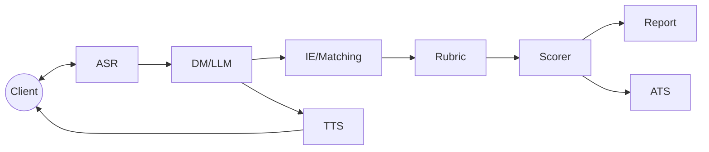
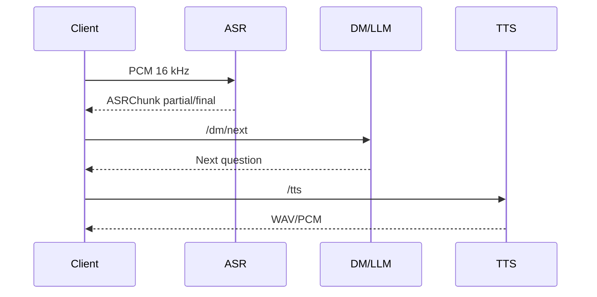
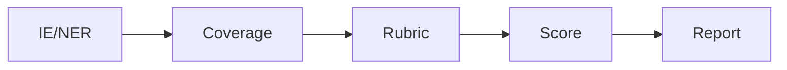

# Архитектура

## Компоненты
- **Клиент** — отправляет PCM‑поток и принимает TTS.
- **ASR** — `/stream/{session_id}` обрабатывает аудио (Riva либо встроенный эвристический VAD).
- **DM/LLM** — строит следующий вопрос по JD и истории (`app/dialog_manager.py`).
- **IE/Matching** — извлекает навыки и проекты (`app/ie.py`) и сравнивает их с JD через FAISS (`app/match.py`).
- **Rubric** — оценивает компетенции с помощью LLM (`/rubric/score`).
- **Scorer** — агрегирует покрытие и рубрику в итоговый балл (`app/scoring.py`).
- **Report/ATS** — формирует HTML/PDF отчёт и синхронизирует решение с ATS.
- **Observability** — Prometheus‑метрики, JSON‑логи.

## Диаграммы

### Компонентная

### Последовательность вопрос→ответ

### Поток данных IE→Report

## SLO
- ASR partial p95 ≤ 400 мс
- ASR final p95 ≤ 900 мс
- TTF‑audio ≤ 300–400 мс
- WER RU ≤ 7–8 %
