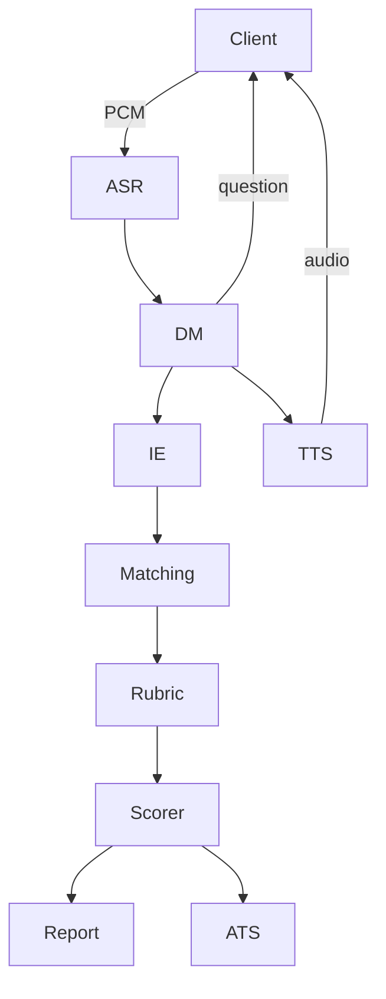
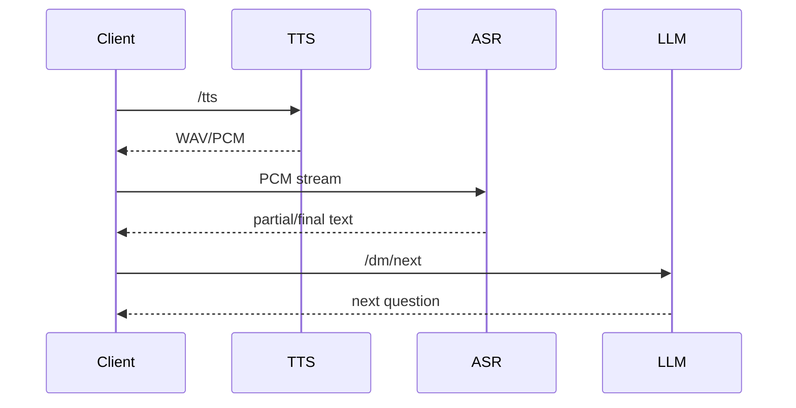
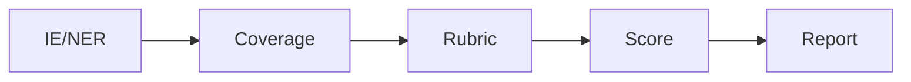

# Архитектура

## Компоненты

- **Клиент (WebRTC)** — отправляет 16‑кГц PCM аудио и получает TTS.
- **ASR** — приоритетно NVIDIA Riva, есть заглушка на WebSocket
  [`/stream/{session_id}`](API.md#ws-streamsession_id).
- **Pre‑proc/VAD** — опциональный `webrtcvad`, фильтрация тишины и барж‑ин.
- **Dialog Manager** — LLM Qwen через vLLM, промпты в
  [`app/dialog_manager.py`](../app/dialog_manager.py).
- **IE/NER** — `extract_ie` использует ESCOXLM‑R и LLM JSON‑экстракцию
  [`app/ie.py`](../app/ie.py).
- **JD‑matching** — эмбеддинги (`BGE_M3`/`conSultantBERT`/`TAROT`) + FAISS
  [`app/match.py`](../app/match.py).
- **Rubric Scorer** — LLM, объединение двух прогонов
  [`/rubric/score`](API.md#post-rubricscore).
- **Final Scorer** — CatBoost/логистическая регрессия
  [`app/scoring.py`](../app/scoring.py).
- **Report/ATS** — HTML/PDF отчёт и синхронизация с ATS.
- **Observability** — Prometheus‑метрики, JSON‑логи с PII‑маскированием.

## Диаграммы

### Общие компоненты

### Последовательность «вопрос→ответ»

### Поток данных IE → Report

## Целевые SLO

- Частичные ответы ASR p95 ≤ 400 мс
- Финальные ответы ASR p95 ≤ 900 мс
- TTF‑audio ≤ 300–400 мс
- WER (ru) ≤ 7–8 %

